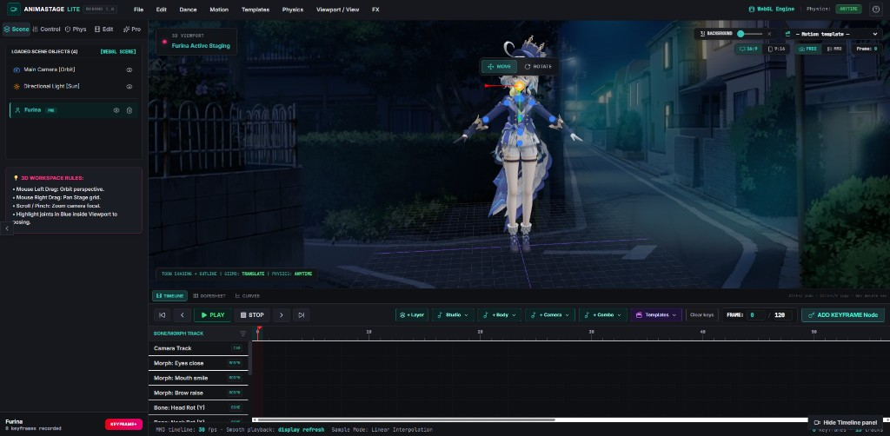

<p align="center">
  <a href="https://animastage-lite.app/app">
    
  </a>
</p>

<h1 align="center">⚡ AnimaStage — Browser-Native MMD Studio</h1>

<p align="center">
  <b>Full MMD production in the browser. No install. No Windows lock-in. Just a tab.</b><br>
  <i>PMX · VMD · Timeline · Bullet Physics · MP4 Export · Shorts-Ready 9:16</i>
</p>

<p align="center">
  <a href="https://github.com/FBNonaMe/animastage-lite"></a>
  <a href="https://github.com/gtausa197-svg/AnimaStage-Pro"></a>
  
  
  
  
  
  <a href="https://animastage-lite.app"></a>
  <a href="https://animastagepro.dev/"></a>
</p>

<p align="center">
  <b>This repository</b> → <a href="https://github.com/FBNonaMe/animastage-lite"><strong>AnimaStage Lite</strong></a> (open source)<br>
  <b>Sibling project</b> → <a href="https://animastagepro.dev/"><strong>AnimaStage Pro</strong></a> · <a href="https://github.com/gtausa197-svg/AnimaStage-Pro">source</a>
</p>

---

## 🎬 What is AnimaStage?

**AnimaStage** is a browser-native **MikuMikuDance** workflow — load PMX/PMD models and VMD motion, tune lighting and physics, edit on a timeline, and export video without desktop MMD or DirectX.

We ship **two editions** for different jobs:

| | [**AnimaStage Lite**](https://animastage-lite.app) · **this repo** | [**AnimaStage Pro**](https://animastagepro.dev/) · [GitHub](https://github.com/gtausa197-svg/AnimaStage-Pro) |
|---|---|---|
| **Focus** | Fast preview · Shorts / Reels / TikTok | Full cinematic production |
| **Live** | [animastage-lite.app](https://animastage-lite.app) · [Studio `/app`](https://animastage-lite.app/app) | [animastagepro.dev/](https://animastagepro.dev/) |
| **Source** | [FBNonaMe/animastage-lite](https://github.com/FBNonaMe/animastage-lite) | [gtausa197-svg/AnimaStage-Pro](https://github.com/gtausa197-svg/AnimaStage-Pro) |
| **Stack** | React 19 · Vite · R3F · TypeScript | WebGL EffectComposer pipeline |
| **Renderer** | WebGL 2.0, DPR 1× in 9:16 Lite | Full post-FX stack (SSAO, DOF, volumetrics, bloom) |
| **Physics** | Bullet WASM, presets | Bullet WASM, deep manual tuning |
| **Timeline** | VMD dopesheet, **Bézier curves**, VMD export | Dual timeline (VMD + cinematic camera) |
| **Characters** | Single scene focus | Multi-character, independent VMD per char |
| **Bone editor** | Root / bone gizmos, morph tracks | Full G/R/S bone editor in viewport |
| **Camera** | Bookmarks, 9:16, letterbox | Spline path, keyframes, track lock |
| **Export** | WebCodecs MP4 HQ + Live | WebCodecs + frame-by-frame HQ render |
| **Extra (Lite app)** | **Demo Gallery**, **Pose Library**, **Model Analyzer**, mocap, AI keys, collab, anim layers | Scene editor, session JSON, weather presets |
| **Target** | Creators, low-spec machines | Studios, production teams |

> **Note:** In the Lite app, **Sidebar → Advanced** means *optional Lite modules* (mocap, AI, collab, layers) — not the separate **AnimaStage Pro** product.

**Lite idea:** ~80% visual impact at ~40% GPU load vs heavy desktop pipelines — ideal when stability and vertical export matter most.

---

## 🆕 Recent updates (changelog)

### 31 May — 2 Jun 2026 (detailed)

Day-by-day log: **[docs/CHANGELOG_2026-05-31_2026-06-02.md](docs/CHANGELOG_2026-05-31_2026-06-02.md)** · Public post: **[docs/PRODUCT_UPDATE_2026-05-31_2026-06-02.md](docs/PRODUCT_UPDATE_2026-05-31_2026-06-02.md)**

| Date | Highlights |
|------|------------|
| **31 May** | **2–4 characters** per ZIP/folder drop · motion auto-assigned · **FPS + triangle** HUD · duo camera groundwork |
| **1 Jun** | **Product layer**: save/share, `/viewer`, templates ~50s, onboarding, beginner mode, stability |
| **2 Jun** | **Generate Short** (keeps VMD, custom length) · camera **follows** models on export · **Manual** MMD orbit · reliable **MP4** |
| **Jun 2026** | **UI/UX overhaul** · design system · stable perf HUD · empty viewport state · Android **v1.1.0** landscape |

### UI & UX overhaul (Jun 2026)

Studio polish for creators — cleaner layout, consistent controls, and performance info you can trust.

| Area | Change | Where in app |
|------|--------|--------------|
| **Design system** | Shared tokens (colors, spacing, radius, type) + reusable **Button**, **Panel**, **Select**, **Toggle**, **Slider**, **SectionHeader**, **CollapsibleSection** | `styles/design-system.css` · `src/components/UI/` |
| **Production UI** | `DEBUG_UI = false` — hides dev overlays (ROOT/GIZMO HUD, detailed perf panel, auto-scale debug line) | `src/config/debugUi.ts` |
| **Studio flow bar** | Save / Share / Generate Short with design-system buttons | Top **Studio flow bar** |
| **Sidebar structure** | Modular sections: **Load** · **Scene** · **Controls** · **Advanced** (Pro modules) | Left sidebar |
| **Empty viewport** | Centered **Add your first character** card with **Try demo scene** — replaces floating drag-drop modal | Viewport (no model loaded) |
| **Copy & tone** | Removed emoji clutter and internal dev wording from studio + landing | App-wide |
| **Stable perf HUD** | **Frame ms** primary (not noisy FPS) · rolling 60-frame average · **CPU / GPU** estimate · **Smooth / Okay / Lagging** · bottleneck label | Bottom-right viewport |
| **Perf toasts** | “Optimizing for your device” and camera hints **auto-hide after ~2.5 s** | Top center · top-right hints |
| **ZIP import** | Recursive archives, macOS junk skipped, clearer errors for PMX/PMD inside nested folders | Drag-drop · **File** upload |
| **Android app** | **v1.2.0** — full studio in WebView, **portrait** lock, Pro Mobile UI, **~20 MB** APK | Landing **`#android`** · [app-debug.apk](/app-debug.apk) |

#### Performance HUD (updated)

| Metric | Meaning |
|--------|---------|
| **Frame** | Smoothed frame time (ms) — primary metric; &gt;16.7 ms ≈ below 60 FPS, &gt;33 ms ≈ below 30 FPS |
| **FPS** | Secondary; 60-frame rolling average, capped at 120 (no 900 FPS spikes) |
| **CPU / GPU** | Lightweight split: JS/update phase vs render gap (no heavy GPU profiling) |
| **Status** | **Balanced** · **CPU bottleneck** · **GPU bottleneck** |
| **Level** | **Smooth** · **Okay** · **Lagging** (from smoothed frame time) |

Auto quality: sustained frame time &gt;25 ms nudges resolution/FX down; stable &lt;16 ms slowly recovers.

Key files: `src/perf/stableFps.ts` · `src/perf/frameCpuGpuTiming.ts` · `src/components/ViewportPerfMonitor.tsx`

### 31 May — Import & performance (details)

| Feature | Description | Where in app |
|---------|-------------|--------------|
| **Multi-character import** | Up to **4** PMX/PMD from one drop, folder, or ZIP; VMD split across models | Drag-drop · **File** upload |
| **Import formats** | PMX, PMD, VMD, textures, HDR in one bundle (ZIP supported) | Same upload flow |
| **Performance HUD** | Smoothed **frame ms**, **FPS**, **CPU/GPU** split, bottleneck + **Smooth/Okay/Lagging** | Bottom-right of viewport |

### June 2026 — Product layer, Shorts, camera & export

| Feature | Description | Where in app |
|---------|-------------|--------------|
| **Product layer** | Save/share, templates (~50s), scene graph, onboarding, quality modes — **without** changing VMD/physics/render core | Top **Studio flow bar** · `src/product/` |
| **Generate Short** | 9:16 vertical, keeps character **VMD**, performance FX, optional duration **20–90s** | **Generate Short** → **Short settings** dialog |
| **Shorts setup** | Per-character **VMD picker**, **Add VMD…**, presets 15/30/50/60/90 s | Dialog before generate |
| **Shorts preview bar** | Auto frame · Manual/Free cam · Share · Export | Top overlay after generate |
| **Stage auto-follow** | Camera tracks 1–2 characters in **Free** mode; **snap** while recording/export | Viewport (with Auto focus on) |
| **MMD camera follow** | Orbit templates move **with** characters (`cameraOrbitAnchor`); VMD cam looks at body, not hand bone | **MMD** mode + emote/dance templates |
| **Manual MMD camera** | Orbit the scene yourself in MMD mode | Viewport **MMD → Manual** or Camera Studio |
| **Viewer + fork** | Read-only `/viewer`, **Edit this** opens editor with scene | `/viewer?scene=…` |
| **MP4 export hardening** | `VideoFrame.close()`, encoder reclaim recovery, fewer GC stalls | FX → Video · Shorts export |
| **Docs** | Dev changelog · public post · GPT architecture report | [CHANGELOG](docs/CHANGELOG_2026-05-31_2026-06-02.md) · [PRODUCT_UPDATE](docs/PRODUCT_UPDATE_2026-05-31_2026-06-02.md) · [GPT report](docs/GPT_ANALYSIS_REPORT.md) |

### Earlier — editor, landing, SEO

| Feature | Description | Where in app |
|---------|-------------|--------------|
| **Demo Gallery** | One-click demo scenes (Dance / VTuber / Cinematic) | Sidebar → **Scene** · `/app?demo=party-dance` |
| **Pose Library** | Presets + capture + JSON import/export (pause only) | Sidebar → **Controls** |
| **Model Analyzer** | PMX health / performance report | Sidebar → **Edit** |
| **Curve Editor** | Bézier timeline tracks (`curveMath.ts`) | Timeline → **Curves** |
| **Landing** | Hero, demo grid, FAQ, JSON-LD | `/` |
| **SEO / deploy** | IndexNow, `sitemap.xml`, `vercel.json` SPA rewrites | `public/` |

### Updated (stability & UI)

| Area | Change |
|------|--------|
| **React** | Product hooks use refs/stable signatures; `ProductShortsFlow` isolates shorts UI state (no update loops). |
| **Post-FX** | Deferred EffectComposer; SSAO/god rays off in Shorts path; safer WebGL ready checks. |
| **Performance** | Analyzer debounce; collab sync decoupled from full `models` array; stable frame-time HUD + auto quality nudge. |
| **UI/UX** | Design system (`styles/design-system.css`), modular sidebar, viewport empty state, `DEBUG_UI` off for production, auto-dismiss hints. |

### New / notable paths

```
styles/design-system.css        # Design tokens + .ds-* primitives
src/components/UI/              # Button, Panel, Select, Toggle, Slider, …
src/components/sidebar/         # LoadSection, SceneSection, ControlsSection, AdvancedSection
src/components/viewport/ViewportEmptyState.tsx
src/config/debugUi.ts           # DEBUG_UI flag (false in production)
src/hooks/useAutoDismiss.ts     # 2.5s toast auto-hide
src/perf/stableFps.ts           # Rolling-average FPS / frame ms
src/perf/frameCpuGpuTiming.ts   # Lightweight CPU vs GPU split
src/perf/stablePerfResponse.ts  # Auto resolution / FX nudge from frame time
src/utils/assetImport.ts        # Multi-PMX / ZIP import (recursive archives)
src/utils/sceneStats.ts         # Triangle count (debug HUD)
src/components/ViewportPerfMonitor.tsx
src/product/                    # Product layer (scene, share, templates, shorts, camera, ux)
src/scene/cameraFocus.ts        # Face/body/full focus + orbit offset for templates
src/scene/cameraFraming.ts      # Solo/duo stage framing
src/scene/characterHeadRegistry.ts
src/components/MMDCameraController.tsx
src/product/camera/StageAutoFollow.tsx
src/product/shorts/applyShortsPipeline.ts
src/product/ux/ShortsSetupDialog.tsx
src/video/mmdVideoRecorder.ts   # WebCodecs reclaim-safe export
src/pages/ViewerPage.tsx
android/                        # Capacitor APK (portrait v1.2.0)
docs/GPT_ANALYSIS_REPORT.md     # Report for GPT / code analysis
```

### Not changed (by design)

- Bullet / Ammo physics pipeline, `mmdFrameLoop`, VMD playback evaluation  
- Core PMX load / skinning / morph solver internals  

---

## 🏆 Key numbers (Lite)

| Metric | Value |
|--------|-------|
| Formats | PMX, PMD, VMD, textures, HDR |
| Vertical export | **1080×1920** (9:16) |
| Physics | Ammo.js (Bullet), ~65 Hz, 3 substeps |
| Post-FX | RTX Lite — bloom, DOF, weather, SSAO-lite |
| Clean capture | No gizmos / grid in export |

---

## ✨ AnimaStage Lite — features (this repository)

<details open>
<summary><b>Click to expand Lite feature list</b></summary>

### Scene and models
- Drag & drop `.pmx` / `.pmd`, textures, multiple `.vmd`, HDR
- Presets or your own model · bone & root gizmos · morphs

### Motion and physics
- VMD playback · Bullet cloth (`anytime` / `playtime` / `off`) · wind · IK

### Camera and framing
- **Free** orbit (auto-follow 1–2 chars) & **MMD** director (VMD / timeline keyframes / emote orbit)
- **Manual** orbit in MMD mode · **Generate Short** with custom duration · **9:16** export

### Visual (RTX Lite)
- Style presets · weather · bloom · DOF · vignette · HDR IBL

### Animation editor
- **Dopesheet** & **Curves** (Bézier handles, draggable keys) · **VMD export** · undo/redo · mirror / stretch

### Editor tools (Sidebar)
| Module | Tab | Purpose |
|--------|-----|---------|
| **Load** | Load | Import PMX/PMD/VMD, ZIP/folder drop |
| **Demo Gallery** | Scene | Instant demo scenes — dance, VTuber, cinematic |
| **Pose Library** | Controls | Presets, capture pose, JSON import/export |
| **Model Analyzer** | Controls / Edit | Texture/performance report after PMX load |
| **Bone / Materials** | Controls / Edit | PMX hierarchy, material highlight |

### Studio UI
- **Design system** — consistent buttons, panels, spacing (`styles/design-system.css`)
- **Empty viewport** — centered onboarding card + **Try demo scene**
- **Performance HUD** — frame ms, FPS, CPU/GPU estimate, Smooth/Okay/Lagging, bottleneck
- **Hints** — perf and camera tips fade after ~2.5 s (non-blocking)

### Sidebar → Advanced (Lite Pro modules)
| Module | Purpose |
|--------|---------|
| Animation layers | Weighted overlays, bone mask, solo/mute |
| Mocap | Video → keys (MediaPipe) |
| AI motion | Gemini keyframes (optional `VITE_GEMINI_API_KEY`) |
| Collab | Local tabs or WebRTC |

### Shorts & sharing (product layer)
- **Generate Short** — dialog: duration, VMD per character, then 9:16 preview bar
- **Share** — viewer link (read-only) · **fork** into editor
- **Scene templates** — ~50s rolls, camera + bloom emotes (MMD mode)

### Video
- **MP4 HQ** — WebCodecs + mp4-muxer (Chrome / Edge), encoder reclaim recovery
- **Live** — MediaRecorder · clean frame · **1080×1920** in 9:16

</details>

### What Pro adds ([demo](https://animastagepro.dev/) · [repo](https://github.com/gtausa197-svg/AnimaStage-Pro))

- Multi-character scenes with per-character VMD  
- Full bone animation editor (G/R/S, mirror, anatomy limits)  
- Cinematic camera spline + dual timeline  
- Full RTX-style composer (SSAO → DOF → volumetric → bloom → grade)  
- Scene outliner, session save/load JSON  
- See the [Pro demo](https://animastagepro.dev/) and [Pro repository](https://github.com/gtausa197-svg/AnimaStage-Pro) for the full pipeline  

---

## 🚀 Quick start — AnimaStage Lite

**Try online:** [animastage-lite.app/app](https://animastage-lite.app/app)

**Run locally** — Node.js 18+ and WebGL2:

```bash
git clone https://github.com/FBNonaMe/animastage-lite.git
cd animastage-lite
npm install
npm run dev
```

| URL | Page |
|-----|------|
| `http://localhost:3000/` | Landing (demo grid, conversion CTAs) |
| `http://localhost:3000/app` | Studio |
| `http://localhost:3000/viewer` | Read-only viewer (+ fork to editor) |
| `http://localhost:3000/app?demo=party-dance` | Studio — featured demo (auto-play) |
| `http://localhost:3000/app?demo=gallery` | Studio — full demo gallery overlay |

```bash
npm run indexnow:submit   # optional — ping search engines (IndexNow)
```

### Android app (download)

Debug APK for sideload: **[app-debug.apk](/app-debug.apk)** (~20 MB) — also linked on the [landing page](https://animastage-lite.app/#android). Build: `npm run build:android`.

**v1.1.0** — opens the full studio in **landscape**, immersive WebView chrome, balanced GPU defaults (same PMX/VMD workflow as the browser).

Rebuild web + APK into `public/`:

```bash
cd android && gradlew.bat assembleDebug
cd .. && npm run sync:android:assets && npm run build
```

```bash
npm run build    # → dist/
npm run preview
npm run lint
```

**Try a demo first:** open `/app?demo=party-dance` or pick a scene on the landing page.

**Your files:** drag PMX + VMD onto the viewport or use **File → Load**.

### Configuration

Copy [`.env.example`](.env.example) → `.env` (optional, for AI / WebRTC collab):

```env
VITE_GEMINI_API_KEY=your_key_from_Google_AI_Studio
# VITE_COLLAB_SIGNALING=wss://your-signaling.example.com
```

Get a Gemini key: [Google AI Studio](https://aistudio.google.com/apikey). Restart `npm run dev` after editing `.env`.

> `VITE_*` values are embedded in the client bundle — do not commit real production secrets.

---

## 🎮 Lite — UI map

| Task | Where |
|------|--------|
| **First launch** | Empty viewport card → **Try demo scene** or drag-drop PMX/ZIP |
| **Instant demo** | Landing → demo tile · **Sidebar → Scene → Demo Gallery** · `/app?demo=…` |
| **Generate Short** | Top bar → settings (duration, VMD) → preview bar → Export |
| Model / VMD | **Sidebar → Load** or drag-drop · **Add VMD** in Short settings |
| Model health check | **Sidebar → Controls → Model Analyzer** |
| Poses (paused) | **Sidebar → Controls → Pose Library** |
| **Performance** | Bottom-right HUD — **Frame ms**, FPS, CPU/GPU, status |
| **MMD camera manual** | Viewport **MMD → Manual** (orbit; hint auto-hides) |
| **Emote + bloom** | Dance/motion templates → switches to **MMD** camera |
| Light, style, weather | **FX** |
| MP4 / Live | **FX → Video** or Shorts **Export** |
| Physics | **File** / MMD Lite panel |
| Timeline, dopesheet, curves | Bottom panel (**Curves** tab) |
| Save / Share project | Top **Studio flow bar** |
| Mocap, AI, layers, collab | **Sidebar → Advanced** |
| 16:9 ↔ 9:16 | Viewport format toggle |
| Free ↔ MMD camera | Viewport **Free** / **MMD** toggle |
| **Android** | Landing **`#android`** · portrait studio APK (~20 MB) |

---

## 🏗️ Lite — project structure

| Path | Role |
|------|------|
| `styles/design-system.css` | Design tokens + shared `.ds-*` styles |
| `src/components/UI/` | Reusable Button, Panel, Select, Toggle, Slider, … |
| `src/components/sidebar/` | Load / Scene / Controls / Advanced sections |
| `src/components/viewport/ViewportEmptyState.tsx` | Empty viewport onboarding card |
| `src/config/debugUi.ts` | `DEBUG_UI` — dev overlays off in production |
| `src/App.tsx` | App state, product layer, shorts, collab, recording |
| `src/RootRouter.tsx` | `/` landing · `/app` studio · `/viewer` |
| `src/product/` | Templates, shorts, share, scene I/O, camera UX (see [`docs/GPT_ANALYSIS_REPORT.md`](docs/GPT_ANALYSIS_REPORT.md)) |
| `src/product/hooks/useProductLayer.ts` | Save, share, Generate Short, templates, camera lock |
| `src/perf/stableFps.ts` | Smoothed frame time + FPS for HUD |
| `src/components/MMDModelWrapper.tsx` | PMX, VMD, physics, layers, pose hold |
| `src/pages/LandingPage.tsx` | Marketing landing (conversion-optimized, Android `#android`) |
| `src/pages/landing/` | Hero mockup, demo grid, conversion bridge, flow diagram |
| `src/demos/` | Demo catalog, `loadDemoPack`, instant scene apply |
| `src/components/gallery/` | Demo gallery UI (panel + overlay) |
| `src/pose/` | Pose library presets, storage, apply to mesh |
| `src/analyzer/` | PMX analysis and validation reports |
| `src/editor/` | Dopesheet, `curveMath`, VMD export |
| `src/hooks/useEditorDocument.ts` | Undo, PMX metadata, analyzer debounce |
| `src/video/` | MP4 HQ / Live, clean capture |
| `src/mocap/` · `src/ai/` · `src/collab/` | Optional Pro panel modules |
| `src/utils/mmdCharacterPhysics.ts` | Bullet / MMD physics |
| `public/demos/` | Demo thumbnails + optional PMX packs |
| `public/vercel.json` | SPA rewrites for `/app`, sitemap |

Docs: [docs/ANIMASTAGE_LITE.md](docs/ANIMASTAGE_LITE.md) · [docs/DEMO_GALLERY.md](docs/DEMO_GALLERY.md) · [docs/CHANGELOG_2026-05-31_2026-06-02.md](docs/CHANGELOG_2026-05-31_2026-06-02.md) · [docs/GPT_ANALYSIS_REPORT.md](docs/GPT_ANALYSIS_REPORT.md) · [SECURITY.md](SECURITY.md)

---

## 📊 Requirements

| Feature | Environment |
|---------|-------------|
| Core app | WebGL2 (Chrome, Edge, Firefox, Safari) |
| MP4 HQ | WebCodecs H.264 (best: Chrome / Edge) |
| AI motion | Gemini API key in `.env` |
| Heavy PMX | Discrete GPU; use **9:16 Lite** on weak PCs |

---

## 🤝 Links

| Edition | Website | Repository |
|---------|---------|------------|
| **Lite** | [animastage-lite.app](https://animastage-lite.app) | [github.com/FBNonaMe/animastage-lite](https://github.com/FBNonaMe/animastage-lite) |
| **Pro** | [animastagepro.dev/](https://animastagepro.dev/) | [github.com/gtausa197-svg/AnimaStage-Pro](https://github.com/gtausa197-svg/AnimaStage-Pro) |

Contributions welcome on **Lite** — issues and PRs on GitHub.

---

## 📄 Citation

```bibtex
@software{animastage2026,
  title   = {AnimaStage: Browser-Native MMD Studio},
  author  = {FBNonaMe},
  year    = {2026},
  url     = {https://animastage-lite.app}
}
```

---

## 📝 License and content

Open-source **AnimaStage Lite** — see `LICENSE` in this repository (if present) and third-party licenses in `package.json`.

**MMD models, motions, and textures** belong to their authors. Use only content you have rights to publish and record.

**AnimaStage Pro** is a separate project — [animastagepro.dev/](https://animastagepro.dev/) · [source](https://github.com/gtausa197-svg/AnimaStage-Pro) · see Pro `LICENSE` for terms.

---

<p align="center">
  <i>🎬 "Drop the PMX. Hit play. No install required."</i><br><br>
  <a href="https://animastage-lite.app/app"><b>AnimaStage Lite</b></a>
  &nbsp;·&nbsp;
  <a href="https://animastagepro.dev/"><b>AnimaStage Pro</b></a>
  &nbsp;·&nbsp;
  <a href="https://github.com/gtausa197-svg/AnimaStage-Pro">Pro on GitHub</a><br>
  <code>animastage-lite@1.0.0</code>
</p>
