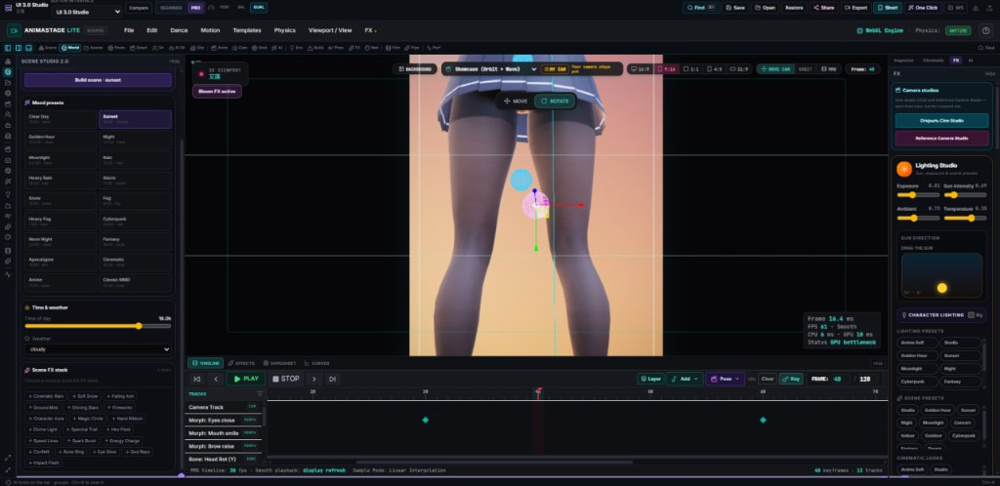

<p align="center">
  <a href="https://animastage-lite.app/app">
    
  </a>
</p>

<h1 align="center">⚡ AnimaStage Lite — Browser MMD Studio</h1>

<p align="center">
  <b>Full MMD production in the browser. No install. No Windows lock-in. Just a tab.</b><br>
  <i>PMX · VMD · UI 3.0 · Scene Studio · Cinematic FX · Timeline · Bullet Physics · MP4 / Shorts</i>
</p>

<p align="center">
  <a href="https://github.com/FBNonaMe/animastage-lite"></a>
  <a href="https://github.com/gtausa197-svg/AnimaStage-Pro"></a>
  
  
  
  
  
  <a href="https://animastage-lite.app"></a>
  <a href="https://animastagepro.dev/"></a>
</p>

<p align="center">
  <b>This repository</b> → <a href="https://github.com/FBNonaMe/animastage-lite"><strong>AnimaStage Lite</strong></a> (open source)<br>
  <b>Sibling project</b> → <a href="https://animastagepro.dev/"><strong>AnimaStage Pro</strong></a> · <a href="https://github.com/gtausa197-svg/AnimaStage-Pro">source</a>
</p>

---

## 🎬 What is AnimaStage Lite?

**AnimaStage Lite** is a browser-native **MikuMikuDance** studio — load PMX/PMD models and VMD motion, build cinematic scenes, edit on a multi-track timeline, tune lighting and post-processing, and export MP4 or vertical Shorts without desktop MMD or DirectX.

The screenshot above shows **UI 3.0 Studio**: **Scene Studio 2.0** on the left (mood presets, time of day, weather, scene FX stack), the **FX** panel on the right (Lighting Studio, character lighting, cinematic looks), a live **Bloom FX** viewport, morph and bone tracks in the bottom timeline, and the performance HUD (frame ms, FPS, CPU/GPU split, bottleneck label).

| | [**AnimaStage Lite**](https://animastage-lite.app) · **this repo** | [**AnimaStage Pro**](https://animastagepro.dev/) |
|---|---|---|
| **Focus** | Fast preview · Shorts / Reels / TikTok · full studio in a tab | Full cinematic production |
| **Live** | [animastage-lite.app/app](https://animastage-lite.app/app) | [animastagepro.dev](https://animastagepro.dev/) |
| **Stack** | React 19 · Vite · R3F · TypeScript · UI 3.0 | WebGL EffectComposer pipeline |
| **Target** | Creators, phones, low-spec machines | Studios, production teams |

---

## 🆕 What's new in 1.4.0

### UI 3.0 Studio

A redesigned studio shell built for cinematic workflows:

- **Scene Studio 2.0** — mood presets (Clear Day, Sunset, Golden Hour, Night, Rain, Snow, Cyberpunk, Anime, Classic MMD, and more), **Time of day** slider, **Weather** selector, and a **Scene FX Stack** (rain, snow, mist, fireworks, aura, god rays, speed lines, confetti, and other stackable scene effects).
- **FX tab** — **Lighting Studio** (exposure, sun intensity, ambient, temperature, draggable sun direction), **Character Lighting** presets, **Cinematic Looks**, and integrated post-processing controls.
- **Camera studios** — Origami Cine Studio, Reference Camera Studio, **Showcase (Orbit + Wave)** mode, aspect ratio presets (**16:9**, **9:16**, **1:1**, **4:3**, **21:9**).
- **Bottom timeline** — **Timeline**, **Effects**, **Dopesheet**, and **Curves** tabs; morph tracks, bone rotation keys, camera track, playback controls, and keyframe count.
- **Performance HUD** — smoothed frame ms, rolling FPS, CPU/GPU estimate, Smooth/Okay/Lagging status, and bottleneck label (bottom-right of viewport).

### Cinematic FX stack

Advanced post-processing passes wired into the live viewport — toggle and tune from the **FX** panel:

| Pass | What it does |
|------|----------------|
| **HDR Bloom** | High-dynamic-range bloom with threshold, intensity, and radius control |
| **Color Grading** | Lift / gamma / gain style grade with exposure and saturation |
| **SSR** | Screen-space reflections on glossy surfaces |
| **Vignette** | Edge darkening with roundness and feather |
| **Lens dispersion** | Radial RGB chromatic shift for cinematic lens character |
| **SMAA** | Anti-aliasing at the end of the chain |

Passes compose in order: ambient occlusion → SSR → bloom → depth of field → grade → lens → vignette → SMAA. When cinematic bloom, vignette, or lens are active, they replace the built-in equivalents for a consistent look.

### Anime NPR render mode

Switch the character render pipeline to **Anime NPR** — a stylized non-photoreal shading mode for clean anime-style characters. Enable from the FX panel; works alongside scene lighting and post-FX.

### Path Tracer Lab

Experimental path-traced preview overlay for still-quality lighting exploration:

- Adjustable samples, bounces, and resolution
- Adaptive quality governor driven by viewport FPS
- **OIDN AI denoise** — optional neural denoising for cleaner results at lower sample counts
- Scene fingerprinting to avoid redundant re-renders

Open from **FX → Path Tracer Lab**.

### Director Workflow

Plan and edit full performances without leaving the studio:

- **Scene Director** — CAST (characters), CLIPS (shot list), MUSIC (audio sync), SCENE (environment)
- **Effect Timeline** — stack scene effects on a dedicated track with in/out windows
- **Effect Curve Editor** — animate effect parameters over time with keyframes
- **Global undo / redo** — scene director state participates in document-level undo

### Pose Library — Smart presets

The **Pose Library** now includes **Smart** IK-style presets (neutral, action, wave, sit, dance-ready, and more) alongside built-in and custom saved poses. Apply while paused; capture and export JSON poses as before.

### Dynamic Sky & Environment Studio

Continuous **24-hour sky** with time-of-day slider, weather presets, fog, clouds, and exposure — synced with scene lighting and mood presets. **Environment Studio** drives outdoor looks; **Scene Studio** mood buttons apply full-scene atmosphere in one click.

### AI & motion capture

| Module | Description |
|--------|-------------|
| **OpenRouter AI** | One API key for the studio; free-model catalog only; connection test in settings |
| **WHAM Video→Motion** | Capture motion from video with keyframe export and BVH output (local MediaPipe or optional server) |

### Mobile & Android 1.4.0

- **CapCut-style home dock** — assets, timeline, camera, FX, render, and more on a bottom panel
- Quiet home viewport; camera modes in a dedicated sheet; bone Move / Rotate without overlap
- **targetSdk 36** (Google Play requirement)
- Clearer errors for legacy glTF 1.0 GLB imports
- Camera, bone edit, and mobile stability fixes

---

## ✨ Core features

<details open>
<summary><b>Full Lite feature list</b></summary>

### Import & models
- Drag & drop PMX, PMD, VMD, textures, HDR; ZIP and folder import (up to 4 characters)
- Bone & root gizmos · morph tracks · material editor

### Motion & physics
- VMD playback · Bullet cloth (`anytime` / `playtime` / `off`) · wind · IK
- **WHAM** video mocap · animation layers (Advanced)

### Camera & framing
- **Free** orbit with auto-follow · **MMD** director (VMD / timeline / emote orbit)
- **Manual** orbit · **Generate Short** (20–90 s, custom VMD per character)
- Aspect ratios: 16:9, 9:16, 1:1, 4:3, 21:9

### Visual
- **Scene Studio 2.0** moods · **Dynamic Sky** · **Lighting Studio**
- RTX Lite baseline (bloom, DOF, weather, SSAO-lite) + **Cinematic FX** stack
- **Anime NPR** render mode · **Path Tracer Lab**

### Animation editor
- **Dopesheet** & **Curves** (Bézier handles) · **VMD export** · undo/redo · mirror / stretch
- **Effect Timeline** & **Effect Curve Editor** (Director Workflow)

### Editor tools
| Module | Purpose |
|--------|---------|
| **Demo Gallery** | One-click demo scenes (dance, VTuber, cinematic) |
| **Pose Library** | Built-in, Smart, custom capture, JSON import/export |
| **Model Analyzer** | PMX health / performance report |
| **Scene Director** | Cast, clips, music, scene FX planning |

### Shorts & sharing
- **Generate Short** — 9:16 vertical, VMD picker, preview bar, MP4 export
- **Share** — read-only viewer link · fork into editor
- WebCodecs MP4 HQ + Live recording · clean capture (no gizmos in export)

### Optional Advanced modules
| Module | Purpose |
|--------|---------|
| Animation layers | Weighted overlays, bone mask, solo/mute |
| OpenRouter AI | Text / motion assistance (free models) |
| Collab | Local tabs or WebRTC |

</details>

### What Pro adds

Multi-character scenes with per-character VMD, full bone G/R/S editor, cinematic camera spline, dual timeline, and a heavier RTX-style composer — see [animastagepro.dev](https://animastagepro.dev/) and the [Pro repository](https://github.com/gtausa197-svg/AnimaStage-Pro).

---

## 🚀 Quick start

**Try online:** [animastage-lite.app/app](https://animastage-lite.app/app)

**Run locally** — Node.js 18+ and WebGL2:

```bash
git clone https://github.com/FBNonaMe/animastage-lite.git
cd animastage-lite
npm install
npm run dev
```

| URL | Page |
|-----|------|
| `http://localhost:3000/` | Landing |
| `http://localhost:3000/app` | Studio (UI 3.0) |
| `http://localhost:3000/viewer` | Read-only viewer |
| `http://localhost:3000/app?demo=party-dance` | Demo scene (auto-play) |

```bash
npm run build      # → dist/
npm run preview
npm run lint
npm run build:android   # Capacitor APK
```

**First steps:** open a demo from the landing page or drag PMX + VMD onto the viewport. Pick a **Scene Studio** mood (e.g. Sunset), open **FX** for Lighting Studio and Cinematic FX, then edit keys on the timeline.

### Configuration (optional)

Copy [`.env.example`](.env.example) → `.env`:

```env
VITE_OPENROUTER_API_KEY=your_key
# VITE_COLLAB_SIGNALING=wss://your-signaling.example.com
```

Restart `npm run dev` after editing `.env`. Do not commit real API keys.

### Android

Debug APK: **[app-debug.apk](/app-debug.apk)** (~20 MB) · landing [**#android**](https://animastage-lite.app/#android)

**v1.4.0** — CapCut-style dock, Dynamic Sky, OpenRouter, WHAM mocap, portrait-friendly sheets, targetSdk 36.

---

## 🎮 UI map (1.4.0)

| Task | Where |
|------|--------|
| **Scene mood & weather** | Left panel → **Scene Studio 2.0** |
| **Scene FX stack** | Scene Studio → effect buttons (rain, aura, god rays, …) |
| **Lighting & post-FX** | Right panel → **FX** tab |
| **Cinematic FX passes** | FX → bundled effects (bloom, grade, SSR, vignette, lens) |
| **Anime NPR** | FX → render mode |
| **Path Tracer Lab** | FX → path tracer + OIDN toggle |
| **Director Workflow** | Templates / Director tabs → CAST, CLIPS, MUSIC, SCENE |
| **Effect timeline** | Bottom → **Effects** tab |
| **Morph / bone keys** | Bottom → **Timeline** / **Dopesheet** / **Curves** |
| **Generate Short** | Top bar → duration & VMD → 9:16 export |
| **Pose Library** | Sidebar → Controls (Smart presets included) |
| **Performance HUD** | Bottom-right viewport |
| **OpenRouter / WHAM** | Settings · Advanced |
| **Dynamic Sky** | Environment Studio · Scene Studio time slider |

---

## 🏗️ Project structure

| Path | Role |
|------|------|
| `src/uiVersions/studio3/` | UI 3.0 shell, tool routing |
| `src/components/sceneStudio/` | Scene Studio 2.0 panel |
| `src/sceneStudio/` | Mood presets, shot states, FX stack |
| `src/dynamicSky/` | 24h sky, weather, apply look |
| `src/postfx/` | Cinematic FX passes (bloom, grade, SSR, vignette, lens) |
| `src/components/standaloneEffects/` | Cinematic FX settings panel, presets |
| `src/render/animeNpr/` | Anime NPR bridge & runtime |
| `src/pathTracer/` | Path Tracer Lab, OIDN, adaptive quality |
| `src/sceneDirector/` | Director workflow, effect registry, keyframes |
| `src/pose/smartPosePresets.ts` | Smart Pose Library presets |
| `src/editor/globalUndo.ts` | Document-level undo including director state |
| `src/product/` | Shorts, share, templates, camera UX |
| `src/components/ViewportPerfMonitor.tsx` | Performance HUD |
| `android/` | Capacitor Android shell |
| `docs/images/studio-ui3-update.png` | UI 3.0 screenshot (this README) |

Further docs: [docs/ANIMASTAGE_LITE.md](docs/ANIMASTAGE_LITE.md) · [docs/DEMO_GALLERY.md](docs/DEMO_GALLERY.md) · [SECURITY.md](SECURITY.md)

---

## 📊 Requirements

| Feature | Environment |
|---------|-------------|
| Core app | WebGL2 (Chrome, Edge, Firefox, Safari) |
| MP4 HQ | WebCodecs H.264 (best: Chrome / Edge) |
| Path Tracer Lab | Discrete GPU recommended |
| OIDN denoise | WebAssembly; falls back gracefully if unavailable |
| OpenRouter AI | API key in `.env` |
| Heavy PMX | Discrete GPU; use **9:16 Lite** on weak PCs |

---

## 🏆 Key numbers

| Metric | Value |
|--------|-------|
| Version | **1.4.0** (Android versionCode 9) |
| Formats | PMX, PMD, VMD, textures, HDR, GLB (glTF 2.0) |
| Vertical export | **1080×1920** (9:16) |
| Physics | Ammo.js (Bullet), ~65 Hz, 3 substeps |
| Post-FX | RTX Lite + Cinematic FX stack + optional Path Tracer |
| Timeline | Morph, bone, camera, effect tracks with Bézier curves |

---

## 🤝 Links

| Edition | Website | Repository |
|---------|---------|------------|
| **Lite** | [animastage-lite.app](https://animastage-lite.app) | [github.com/FBNonaMe/animastage-lite](https://github.com/FBNonaMe/animastage-lite) |
| **Pro** | [animastagepro.dev](https://animastagepro.dev/) | [github.com/gtausa197-svg/AnimaStage-Pro](https://github.com/gtausa197-svg/AnimaStage-Pro) |

Contributions welcome — issues and PRs on GitHub.

---

## 📄 Citation

```bibtex
@software{animastage2026,
  title   = {AnimaStage: Browser-Native MMD Studio},
  author  = {FBNonaMe},
  year    = {2026},
  url     = {https://animastage-lite.app}
}
```

---

## 📝 License and content

Open-source **AnimaStage Lite** — see `LICENSE` in this repository and third-party notices in `package.json`.

**MMD models, motions, and textures** belong to their authors. Use only content you have rights to publish and record.

**AnimaStage Pro** is a separate project — [animastagepro.dev](https://animastagepro.dev/) · [source](https://github.com/gtausa197-svg/AnimaStage-Pro).

---

<p align="center">
  <i>🎬 Drop the PMX. Build the scene. Hit play. No install required.</i><br><br>
  <a href="https://animastage-lite.app/app"><b>AnimaStage Lite</b></a>
  &nbsp;·&nbsp;
  <a href="https://animastagepro.dev/"><b>AnimaStage Pro</b></a><br>
  <code>animastage-lite@1.4.0</code>
</p>
