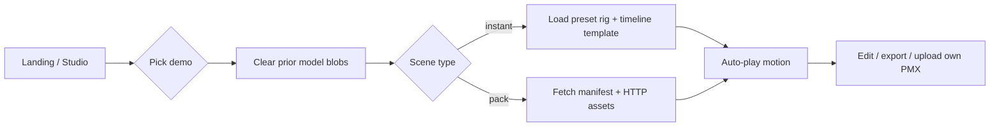

# Demo Gallery — product & engineering notes

## UX flow



1. User opens **animastage-lite.app** or `/app`.
2. **Scene** tab → **Demo Gallery** (or landing grid / `?demo=party-dance`).
3. One click: previous custom blobs revoked, scene replaced, playback starts (~2s on instant demos).
4. User can drop own PMX+VMD anytime; gallery does not change physics settings.

## UI layout

| Zone | Content |
|------|---------|
| Sidebar → Scene | Category pills, featured quick-start, 2-column card grid |
| Full-screen overlay | Same gallery (`?demo=gallery` or “Full-screen gallery”) |
| Landing `#demo` | 6 thumbnail cards + “Browse all demos” |
| Top banner | Shown after deep-link demo; link to more demos |

## Data structure

See `src/demos/types.ts` and `src/demos/demoCatalog.ts`.

- **instant** — `modelPreset` + `templateId` (no files required).
- **pack** — `manifestUrl` → `public/demos/<id>/manifest.json` with PMX/VMD paths.

## Loading code

Instant (in-app):

```ts
import { getDemoScene } from './demos/demoCatalog';
import { buildInstantDemoModel } from './demos/buildDemoModel';
import { applyInstantDemoState } from './demos/applyInstantDemo';

const demo = getDemoScene('party-dance');
if (demo?.kind === 'instant') {
  const modelId = `model_${Date.now()}`;
  const newModel = buildInstantDemoModel(demo, modelId);
  setAppState((prev) =>
    applyInstantDemoState(prev, demo, modelId, newModel, prev.objects.filter((o) => o.type !== 'model'))
  );
}
```

Hosted pack:

```ts
import { loadDemoPack } from './demos/loadDemoScene';

const result = await loadDemoPack('./demos/my-pack/manifest.json');
if (!('error' in result)) {
  onLoadCustomModel(result); // same path as drag-and-drop
}
```

Physics (`physicsMode`, `mmdLite`, Jolt/Ammo) is untouched by the gallery.
