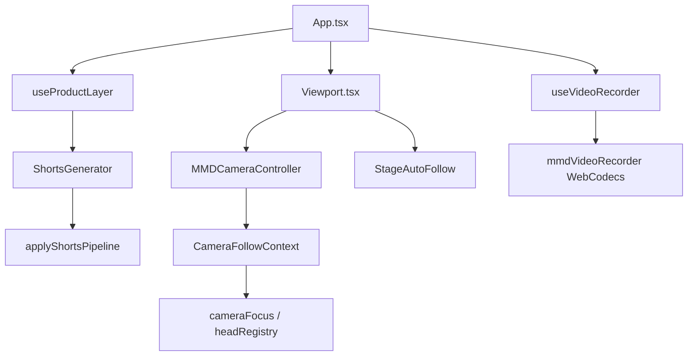

# AnimaStage Lite — Analysis Report (GPT / Code Review)

**Repository:** `web-mmd-suite` (AnimaStage Lite)  
**Report date:** 2026-06-02  
**Work period:** **31 May — 2 June 2026** → [`CHANGELOG_2026-05-31_2026-06-02.md`](CHANGELOG_2026-05-31_2026-06-02.md)  
**Branch / state:** local development (no `.git` in working copy)

**Related docs:** [README](../README.md) · [PRODUCT_UPDATE](PRODUCT_UPDATE_2026-05-31_2026-06-02.md)

### At a glance by day

| Date | Focus |
|------|--------|
| **31 May** | Import 2–4 PMX/PMD, ZIP (`assetImport`), HUD **FPS + triangles** |
| **1 Jun** | **Product layer**: scene/share/viewer/templates, onboarding, React/FX fixes |
| **2 Jun** | **Generate Short** (VMD safe), camera follow + Manual MMD, MP4 WebCodecs fix |

---

## 1. Project goal

**AnimaStage Lite** is a browser-based MMD studio: PMX/PMD + VMD, timeline, Bullet physics, MP4 export, 9:16 vertical format for Shorts/Reels/TikTok.

A **product layer** (`src/product/`) sits on top of the engine **without changing**:
- VMD evaluation / playback;
- WASM/Bullet physics;
- render loop / WebGL pipeline;
- morph / IK / skeleton.

Integration happens through `AppState`, `applyTemplate`, `cameraStudio`, viewport format, and product hooks.

---

## 2. Routes and UX flow

| URL | Purpose |
|-----|---------|
| `/` | Landing (demos, CTAs) |
| `/app` | Editor (`App.tsx`) |
| `/viewer` | Read-only scene view + fork to editor |
| `/app?demo=<id>` | Auto-load demo |

**Target flow:** Open → demo playing → Generate Short → preview → export → share → viewer “Edit this” → fork.

---

## 3. Major code additions

### 3.1 Product layer (`src/product/`)

| Module | Files | Purpose |
|--------|-------|---------|
| **scene/** | `SceneManager`, `codec`, `serialize`, `storage`, `qualityMode` | Save/load `.animastage`, autosave, quality presets |
| **share/** | `shareLink`, `fork`, `encode` | Viewer URL, fork into `/app` |
| **templates/** | `templateEngine`, `TemplateManager`, `sceneTemplates`, `duration` | ~50s scenes, motion/camera templates |
| **shorts/** | `ShortsGenerator`, `applyShortsPipeline`, `shortsConfig`, `ShortsSetupDialog` | Generate Short without resetting VMD |
| **camera/** | `StageAutoFollow`, `frameShortCamera`, `CameraController` | Auto framing for 1–2 characters in `free` mode |
| **camera-presets/** | `CameraPresetManager` | Camera presets via template API |
| **assets/** | `AssetPipeline` | Auto optimizations from analyzer report |
| **ux/** | `ProductShortsFlow`, `ShortsFlowBar`, `SceneGraphPanel`, `beautify` | Product UI, isolated shorts state |
| **hooks/** | `useProductLayer.ts` | Central API: save, share, shorts, templates |
| **onboarding/** | `OnboardingOverlay`, `ResultFirstBar` | First launch, CTAs |
| **ui/** | `TemplatePicker`, `PerformanceOverlay`, beginner mode | Beginner/Pro, templates |

### 3.2 Scene & camera (engine-adjacent, product-safe)

| File | Purpose |
|------|---------|
| `src/scene/cameraFraming.ts` | Solo/duo framing, `getStageTargetVector` |
| `src/scene/cameraFocus.ts` | Face/body/full focus, orbit keyframe offset |
| `src/scene/characterHeadRegistry.ts` | Root registration, head, duo FOV boost |
| `src/context/CameraFollowContext.tsx` | Follow API for MMD camera mode |

### 3.3 Video / recording

| File | Changes |
|------|---------|
| `src/video/mmdVideoRecorder.ts` | WebCodecs: `VideoFrame.close()`, drain queue, recreate encoder on `QuotaExceededError` / inactivity |
| `src/hooks/useVideoRecorder.ts` | 3× rAF before frame capture (pose + camera) |

### 3.4 MMD camera / Shorts (feedback-driven fixes)

| Problem | Solution |
|---------|----------|
| Generate Short reset VMD / motion templates | `applyShortsPipeline` — 9:16, FX, timeline only; `preserveCharacterMotion()` |
| Camera did not follow during export | `StageAutoFollow` — snap when `isRecordingCapture()` |
| Character left frame (orbit around 0,10,0) | `cameraOrbitAnchor` + `offsetCameraSnapshotToFocus()` |
| MMD + Bloom framed on hand | VMD lookAt → character focus; keyframes offset with anchor |
| Manual camera needed in MMD | `manualCameraLock` + OrbitControls in MMD mode, **Manual** in viewport |

### 3.5 Shorts — user settings

| Feature | File |
|---------|------|
| Duration 20–90 s, presets 15/30/50/60/90 | `shortsConfig.ts`, `ShortsSetupDialog.tsx` |
| VMD per character + Add VMD | `useProductLayer.appendModelVmdFiles`, dialog |
| Auto frame / Manual / Free cam in preview | `ShortsFlowBar.tsx` |

### 3.6 Earlier (see README)

- Demo Gallery, Pose Library, Model Analyzer, Curve Editor  
- Landing SEO, IndexNow, `RootRouter`, `RootErrorBoundary`  
- EffectComposer: deferred mount, SSAO only if enabled, God Rays off in Shorts path  

---

## 4. Key types and state

```typescript
// AppState (fragment)
cameraMode: 'free' | 'mmd';
cameraKeyframes: CameraKeyframe[];
cameraOrbitAnchor?: [number, number, number];  // NEW — orbit center when applying template
cameraStudio: {
  autoFocus: boolean;
  manualCameraLock?: boolean;
  focusTarget: 'face' | 'body' | 'full';
  orbitPreset, liveOrbit, ...
};
// MMDModel
vmdBlobUrls, vmdFileNames, activeVmdIndex, vmdPlaybackEnabled;
```

---

## 5. Component dependencies (simplified)



---

## 6. Limitations (by design, not bugs)

1. **Shorts pipeline** does not stitch multiple VMDs back-to-back in one clip — only active VMD selection + adding files.
2. **Product layer** does not modify `mmdFrameLoop` / physics evaluation.
3. **MP4 HQ** requires Chrome/Edge WebCodecs; long exports — keep the tab active.
4. **Camera Studio panel** (`CameraStudioPanel.tsx`) may not be wired in Sidebar — orbit presets also available via dance/emote templates and viewport **Manual**.

---

## 7. Regressions already fixed

| Symptom | Cause | Fix |
|---------|-------|-----|
| Maximum update depth exceeded | Unstable deps in `useProductLayer`, shorts phase in product return | Refs, `ProductShortsFlow` isolated state |
| EffectComposer `alpha` null | Composer mounted before WebGL ready | Deferred composer, stricter ready check |
| Landing disappeared | Auto-redirect `/` → `/app` | Reverted redirect |
| Export button loop | Export handler in product layer | Handler in `ProductShortsFlow` |
| Template ~50s truncated | Duration / keyframes | `DEFAULT_TEMPLATE_DURATION_SEC = 50`, plan before motion |

---

## 8. GPT prompt (copy-paste)

```
Analyze the AnimaStage Lite repository (React 19 + R3F + Three.js MMD).

Context:
- Product layer in src/product/ wraps the engine without changing VMD/physics/render loop.
- Generate Short uses applyShortsPipeline (VMD preserved, free camera + StageAutoFollow).
- MMD camera: cameraOrbitAnchor + offsetCameraSnapshotToFocus; manualCameraLock for orbit.
- Export: mmdVideoRecorder with reclaim-safe VideoEncoder.

Tasks:
1. Check cameraMode free/mmd consistency across Viewport, MMDCameraController, StageAutoFollow.
2. Find race conditions during offline MP4 export (playhead vs currentFrame vs capturing).
3. Suggest minimal improvements for multi-VMD sequencing in shorts (without changing VMD eval).
4. List files required for an E2E test of Shorts + MMD emote template.
```

---

## 9. New / substantially changed files (checklist)

```
src/product/**                    # full product layer
src/scene/cameraFocus.ts
src/scene/cameraFraming.ts
src/scene/characterHeadRegistry.ts
src/components/MMDCameraController.tsx
src/components/PortraitCameraFraming.tsx
src/components/Viewport.tsx
src/components/flow/StudioFlowBar.tsx
src/context/CameraFollowContext.tsx
src/video/mmdVideoRecorder.ts
src/hooks/useVideoRecorder.ts
src/hooks/useTimeline.ts          # cameraOrbitAnchor on template apply
src/types.ts                      # manualCameraLock, cameraOrbitAnchor
src/App.tsx                       # product integration, ShortsSetupDialog
src/RootRouter.tsx
src/pages/ViewerPage.tsx
```

---

## 10. Build

```bash
npm install
npm run dev    # :3000
npm run build  # vite production
```

Node 18+, WebGL2; for MP4 use Chrome/Edge.

---

*Pass this file to ChatGPT / Claude / another LLM together with selected sources or the full repository.*
